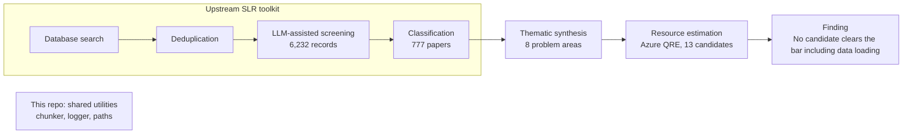

# Quantum Finance

Shared utilities from an MSc thesis on practical quantum advantage in finance.

> [!NOTE]
> **Reference only.** Curated public edition of a completed MSc thesis. It does not include the paper corpus or reproduce the thesis results.

## Overview

The MSc thesis at Copenhagen Business School asks: does gate-based quantum
computing deliver practical advantage in finance? It screened 6,232 records down
to 777 papers and synthesised them across eight problem areas through an
AI-supported thematic-analysis workflow using several LLMs. The thesis PDF is
not published in this repo; see [methodology and limitations](docs/methodology.md).

## Result

The 13 candidates favoured by the literature were costed with Azure's Quantum
Resource Estimator, including the cost of loading classical data. None of the
13 clears the practical-advantage bar once that cost is counted. Quantum finance
is an integration problem rather than a list of algorithms.

## Architecture



- Search through classification ran in the upstream SLR toolkit.
- This repo publishes only the shared utilities; the corpus and extraction pipeline stay private.

## Included utilities

- [Text chunker](shared/tools/text_chunker.py): section-aware chunking and token-budget truncation.
- [Logger](shared/tools/logger.py): structured local logging with revision metadata.
- [Paths](shared/tools/_paths.py): project-root discovery with an environment override.

## Quick start

Use Python 3.12+ from the repo root. The default path uses the standard library
and needs no API credentials. Run the utility tests:

```bash
git clone https://github.com/TelesforoAleix/quantum-finance.git && cd quantum-finance
python3 -m unittest discover -s tests -v
```

Token budgeting falls back to approximately four characters per token. Optional
`tiktoken` enables tokenizer-based counting and may download tokenizer data.
Utilities write logs under `logs/`, which is excluded from version control.

## Related repositories

| Repository | Role |
| --- | --- |
| [quantum-finance-slr](https://github.com/vallahrich/quantum-finance-slr) | Systematic-review toolkit: searching, ingestion, deduplication, screening, and topic coding. |

The extraction pipeline is kept private.

The upstream toolkit has its own history, dependencies, and setup instructions.
Its files are not bundled here, and this release's publication review does not
cover its contents or history.

## Contributors

The thesis was co-authored by Aleix Moreno Telesforo
([TelesforoAleix](https://github.com/TelesforoAleix)) and Vincent Wallerich
([vallahrich](https://github.com/vallahrich)). Aleix was a substantial contributor
to the parent research repository. Its development history also credits
[superman32432432](https://github.com/superman32432432).

This edition starts with a new Git history, so its contributor graph does not
represent the original collaboration.

## Publication Scope

This is a curated code and documentation release. Papers, extracted article text,
manuscripts, reviewer material, research datasets, credentials, configurations,
caches, and generated model outputs are excluded. The original research history
is retained privately.

See [publication scope](docs/publication-scope.md) for the release boundary and
checks. Included code and documentation retain the original [MIT license](LICENSE).
